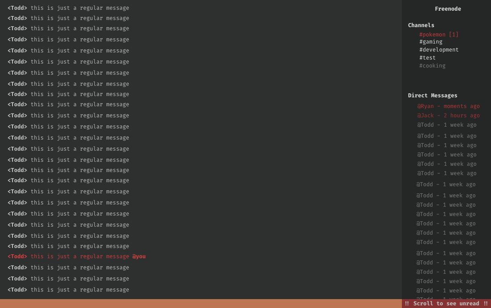

## :coffee: Espresso

Espresso is a terminal-based IRC client written in Rust. It is intended to be a personal portfolio project and not necessarily production-ready software.

As such, I have significantly limited the project scope. This means that features such as multi-network support, and support for bouncers are not present or are untested. You are welcome to submit a PR or fork this project if you'd like to add them though!

## Design

Some poorly designed mockups by myself to give an example of what I'd like the final product to look like. Ideally the colors would mostly inherit from your terminal scheme, in the case of the mockup I utilized my own terminal's color scheme as a proof of concept.



## License

This project is licensed under the MIT License:

```
Copyright 2020 Ryan Warsaw

Permission is hereby granted, free of charge, to any person obtaining a copy of this software and associated documentation files (the "Software"), to deal in the Software without restriction, including without limitation the rights to use, copy, modify, merge, publish, distribute, sublicense, and/or sell copies of the Software, and to permit persons to whom the Software is furnished to do so, subject to the following conditions:

The above copyright notice and this permission notice shall be included in all copies or substantial portions of the Software.

THE SOFTWARE IS PROVIDED "AS IS", WITHOUT WARRANTY OF ANY KIND, EXPRESS OR IMPLIED, INCLUDING BUT NOT LIMITED TO THE WARRANTIES OF MERCHANTABILITY, FITNESS FOR A PARTICULAR PURPOSE AND NONINFRINGEMENT. IN NO EVENT SHALL THE AUTHORS OR COPYRIGHT HOLDERS BE LIABLE FOR ANY CLAIM, DAMAGES OR OTHER LIABILITY, WHETHER IN AN ACTION OF CONTRACT, TORT OR OTHERWISE, ARISING FROM, OUT OF OR IN CONNECTION WITH THE SOFTWARE OR THE USE OR OTHER DEALINGS IN THE SOFTWARE.
```